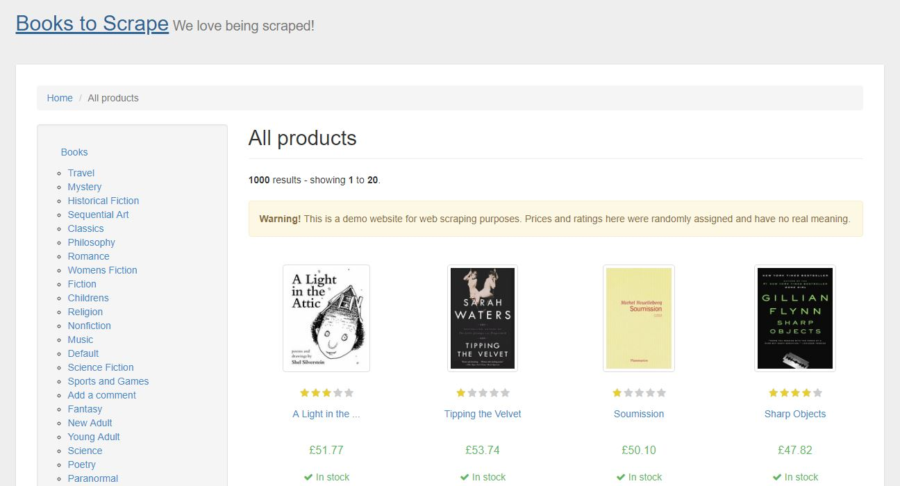
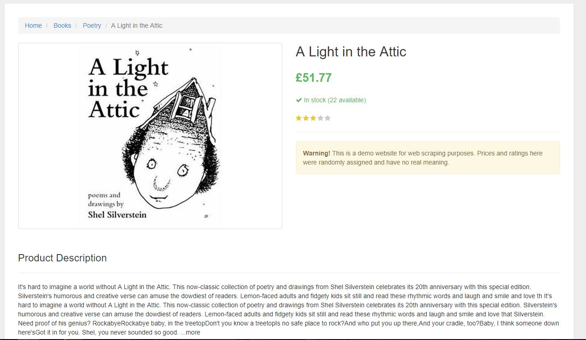

# Books To Scrape [URL](http://books.toscrape.com/)
##Screenshots

### Main Page

### Book's Page Sample 

## Spiders 
* books 

## Usage 
1. Scrapping Every book's page in the first page 
	- book's title 
	- book's price 
	- book's Image URL and download every image. 
2. Yield the URL for the Next Page 
3. Scrapping Every book's page 
4. use the command 'scrapy crawl books -o output.csv' to run the 'books' spider and output the data to output.csv 
4. Wait 2-3 minutes 
5. check the downloaded images in './books_crawler/imgs'

